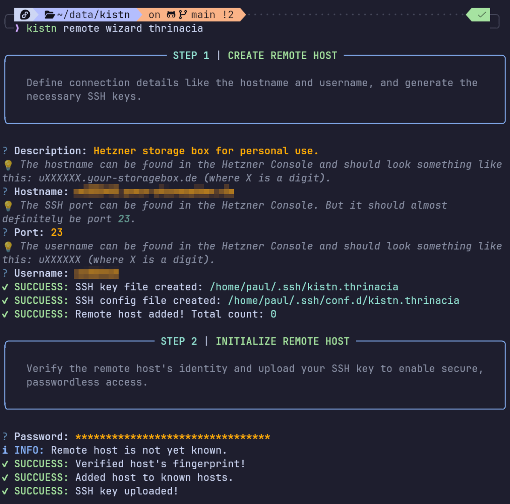
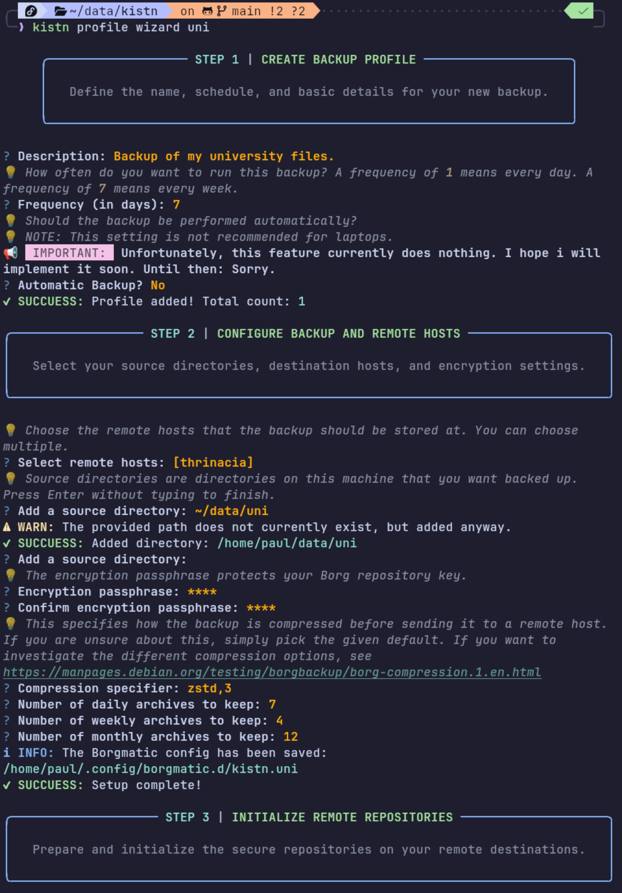

<div align="center">

# 📦 `kistn`

[](https://github.com/Kangonaut/kistn/blob/main/LICENSE)

</div>

`kistn` is a CLI manager for [Borgmatic](https://torsion.org/borgmatic/) and [Hetzner storage box](https://www.hetzner.com/storage/storage-box/) backups.

### Why does this project exist?

I am very forgetful. I've been using Borgmatic to run my backups for a while now, but every time I want to configure a new backup, I need to look up how to do it again. Sure, I could simply write a guide for myself or ask some AI, but I thought: Why not create a small CLI tool that does everything for me. This also solves my second problem: I always forget to actually do the backups. So why not build a tool that guides you through the setup and also reminds you to do your backups, or even does the backups automatically in the background.

### Should I use `kistn`?

If you are also forgetful or you don't want to read up on how Borgmatic works, then I think this might be a helpful tool for you. I've tried to make the user experience as simple as possible and to guide the user through the setup process. I hope that this means that it can even be used by people, who are not heavy-terminal users. However, it is a CLI tool, so if you'd rather just click some buttons in a fancy GUI, there are surely better options out there. Anyway, this tool is far from being a mature software, but I think it is still usable. If you encounter any problems, you can open an issue and hope for a reply. Sorry, I'm often busy. :)

### Why should I use a Hetzner storage backup box?

There are many other options out there and I'm not saying Hetzner has the best solution. But considering the options I've used so far, it is probably the best and cheapest option I know. `kistn` technically works with any server that is running `borg` and OpenSSH, but it is meant to be used with a Hetzner storage box, because that's what I use. :)

## Getting Started

### 0. Install `uv`

`uv` is a really nice Python package manager. It's technically not required to install `kistn`, but if you don't know what you are doing, simply use `uv`. You won't be disappointed.

1. Check if `uv` is already installed: `uv --version`.
2. If not, follow the [installation instructions](https://docs.astral.sh/uv/getting-started/installation/) or simply run the following command:

```shell
curl -LsSf https://astral.sh/uv/install.sh | sh
```

### 1. Install `kistn`

1. Install using `uv`: `uv tool install kistn`

### 2. Check Dependencies

1. Run `kistn doctor` to see if your system has all the necessary packages installed.

### 3. (Optional) Add Overdue-Check to Shell Config

If you want to get a reminder to do your overdue backups every time you open a new shell session, then follow the instructions below. The reminder will look something like this:

```shell
⚠ WARN: basic: Your last backup was 7 days ago. Run `kistn run basic` to start the backup.
```

1. Open your shell config in your favourite editor. If you are using `zsh`, open `~/.zshrc`. If you are using `bash`, open `.bashrc`.
2. If you're using `bash` or `zsh`, add the following lines to the very top of your config:

```bash
# Check for overdue kistn backups
if [ -f "$HOME/.local/bin/kistn" ]; then
    "$HOME/.local/bin/kistn" check-overdue
fi
```

TODO: add instructions for other shells like `fish`

### 4. Setup the Storage Box

1. Go to the [Hetzner Console](https://console.hetzner.com/) and find your storage box.
2. Make sure that **SSH Support** and **External Reachability** is enabled.
3. Keep the page open to look up the hostname, username and port later.

### 5. Create a Remote Connection

1. Run `kistn remote wizard NAME` and follow the instructions. `NAME` should be a simple name to identify your storage box. It probably makes sense to simply adopt the name that is displayed in the Hetzner Console.
2. Run `kistn remote list` to check if the remote connection is ready to use. It should say `ready` in the `State` column.

**NOTE:** If the `kistn remote wizard` command fails or you interrupt it, you can continue the setup by simply running the command again.

<div align="center">
    
</div>

### 6. Create a Backup Profile

1. Run `kistn profile wizard NAME` and follow the instructions. `NAME` should again be a simple name to identify your backup profile, such as `basic`, `documents`, `university`, `photos`, ...
2. Make sure you store your paper key at a secure location.
3. Run `kistn profile list` to check if the profile is ready. Again, it should say `ready` in the `State` column.

**NOTE:** If the `kistn remote profile` command fails or you interrupt it, you can continue the setup by simply running the command again.

<div align="center">
    
</div>

### 7. Create your first Backup

1. Run your first backup using `kistn run PROFILE-NAME`.

### 8. Check when to do your next Backup

1. Use `kistn status` to see when you did your last backup and when the next backup is due. If you chose a frequency of 7, it should say `in 7 days`.

## License

Distributed under the [Apache License 2.0](https://github.com/Kangonaut/kistn/blob/main/LICENSE).
